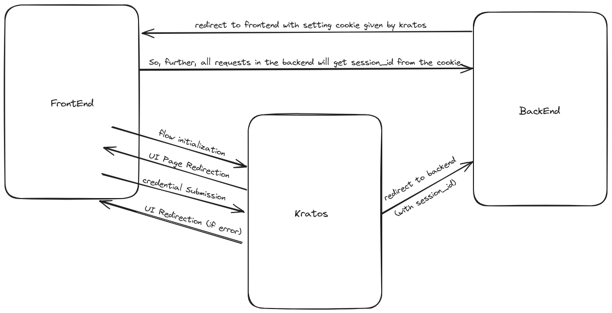

# Golang Boilerplate with Ory Kratos Integration

For setting up the Ory Kratos service with other services, you have to execute ```docker-compose --profile kratos up```.

This will start the Ory Kratos service with other Database and adminer services.

This Kratos service takes configuration values from the files located inside ```./pkg/kratos```

For configuring kratos according to the requirements you'll have to update file and environment variables.

## Configuration
1. You'll have to set ```KRATOS_ENABLED``` environment variable to `true` to enable Kratos support.
2. For all configuration values of ```kratos.yml``` there are environment variables.
    
    **Note:** Environment variables get higher priority than file configuration values. So make sure before changing values directly from the file.

    - Those environment variables are in a pre-defined format so if you want to add some config values you'll have to follow the format.
        
        - The format is hierarchical and appends each key by `_`.
        - let's take an example to understand it better.
            ```yaml
            some:
                nested_key:
                    with_a_value: foo
                    and_array:
                        - id: foo
                        - id: bar
            ```
            The above values can be set using the following environment variables.
            
            ```SOME_NESTED_KEY_WITH_A_VALUE=value``` 
            ```SOME_NESTED_KEY_AND_ARRAY_0_ID=foo```
            ```SOME_NESTED_KEY_AND_ARRAY_1_ID=bar```

            In the case of Array, you'll have to specify it with indexing and with key value, if there are no key values just keep indexing. For more see the [documentation](https://www.ory.sh/docs/ecosystem/configuring#loading-configuration-from-environment-variables).
    - For adding new fields to the Kratos config, you'll need to add it to the `kratos.yml` file and mention it in the `.env`` file. For a list of supported configurations, visit the [documentation](https://www.ory.sh/docs/kratos/reference/configuration)

    - There is an endpoint(`/kratos/auth) for Kratos authentication in this boilerplate, inside your Kratos configuration, after registration and login hook you have to specify this endpoint URL. For more see the [here](#how-kratos-integration-works).

    - For adding support of different oidc providers for social sign-in, You first need to add the jsonnet file inside `/pkg/kratos/oidc` folder. You can find the corresponding jsonnets and details [here](https://www.ory.sh/docs/kratos/social-signin/generic).

    - Base64 this jsonnet schema using below command and then replace it inside the `kratos.yml` configuration.
        - ```bash 
             base64 -w 0 <provider>.schema.jsonnet
            ```
        - As an example, There is Google provider already enabled.
    - After this use this value in `mapper_url` in the `kratos.yml` configuration.
    - You will also need to have the cliendId, secrets and other details of the specific provider before using it.
    - For setting up OAuth 2.O using Google see the steps [here](https://support.google.com/cloud/answer/6158849?hl=en).

3. For Kratos schema configuration you have to edit the ```identity.schema.json```. This will change the user schema.
    
    - Use this in case you want specific details in the registration form to get it from the user.

    - After changing the Kratos schema, You'll need to edit the **user** struct and database migrations, so that you can store user details into the database.

        - For example, If you added a field `surname` in the identity schema. Then inside struct, you'll have to add a field, as shown below:

            ```go
            type User struct {
                --- other details

                FirstName string `json:"first_name" db:"first_name" validate:"required"`
                LastName  string `json:"last_name" db:"last_name" validate:"required"`
                Email     string `json:"email" db:"email" validate:"required"`
                Surname   string `json:"surname" db:"surname"`
            }
            ```
    - For steps of customizing identity schema, visit [here](https://www.ory.sh/docs/kratos/manage-identities/customize-identity-schema).

## Implementation
For all the endpoints that require Kratos authentication, You'll required to add middleware and auth endpoints before it while establishing routes.

#### Example
route.Get("/\<end-point\>", middlewares.Authenticated)

## How Kratos Integration Works?
You have to provide Kratos with your UI endpoint URLs, Kratos will redirect to those endpoints by initializing the flow.

So, the flow will be,

1. On initialization of user identity activities call kratos with specific functionality endpoint.
2. After that kratos will redirect to the respective UI url provided by you inside the configuration file with `flow_id` in query param.
3. After that on Submit you have to call the kratos with same flow_id as query param and `Form Data` in payload. 
4. Then kratos will redirect to the `default_return_url` provided into the configuration. (*In case of registration and login, kratos will redirect to backend and then backend will store the data and set up cookie for the frontend.)    

After successful authentication, it will redirect to the backend Endpoint using which we can store user details in our database.

And for further transactions with backend endpoints, Cookie will be there.


#### Reference Image

